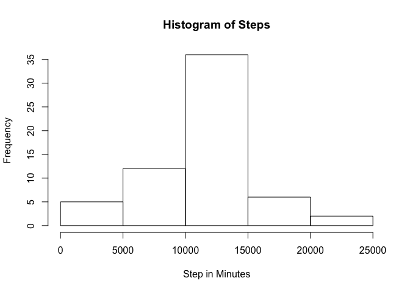
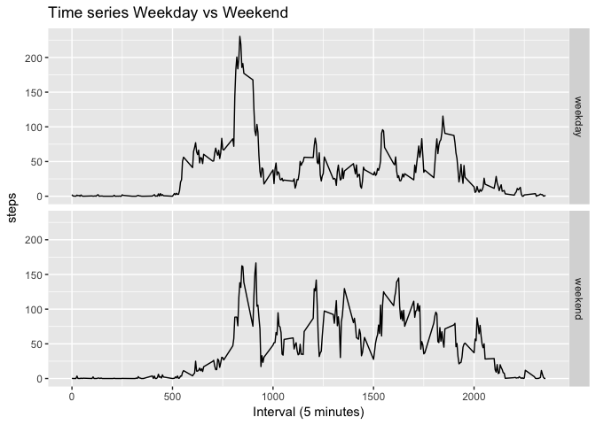

# Reproducible Research: Peer Assessment 1


## Loading and preprocessing the data


```r
activity <- read.csv('activity.csv')
```


## What is mean total number of steps taken per day?

1. Calculate the total number of steps taken per day

```r
ds <- with(activity, aggregate(steps ~ date, data=activity, sum))
```

2. Plot a histogram of the total number of steps taken each day

```r
hist(ds$steps, main="Steps per day", xlab="Steps")
```

<!-- -->

3. Calculate and report the mean and median of the total number of steps taken per day

```r
c(mean=mean(ds$steps), median=median(ds$steps))
```

```
##     mean   median 
## 10766.19 10765.00
```

## What is the average daily activity pattern?

1. A time series plot of the 5-minute interval (x-axis) and the average number of steps taken, averaged across all days (y-axis)

```r
ds <- aggregate(steps ~ interval, data=activity, mean)
with(ds, plot(interval, steps, type="l"))
```

<!-- -->

2. Which 5-minute interval, on average across all the days in the dataset that contains the maximum number of steps

```r
ds[which.max(ds$steps),]
```

```
##     interval    steps
## 104      835 206.1698
```

## Imputing missing values

1. Calculate and report the total number of missing values in the dataset (i.e. the total number of rows with NAs)


```r
filter.na <- is.na(activity)
sum(filter.na)
```

```
## [1] 2304
```

2. Devise a strategy for filling in all of the missing values in the dataset. The strategy does not need to be sophisticated. For example, you could use the mean/median for that day, or the mean for that 5-minute interval, etc.


```r
## get the mean of 5 minute interval
mean5minute <- with(activity, tapply(steps, interval, mean, na.rm=TRUE))

## get a dataset with contain NA steps
activity_na <- subset(activity, is.na(activity))

# replace a na value with mean for each 5 minute interval
for(i in 1:nrow(activity_na)){
    column_name <- paste(activity_na[i, "interval"])
    activity_na[i, "steps"] <- mean5minute[column_name]
}

## preview sample na replacement value
head(activity_na)
```

```
##       steps       date interval
## 1 1.7169811 2012-10-01        0
## 2 0.3396226 2012-10-01        5
## 3 0.1320755 2012-10-01       10
## 4 0.1509434 2012-10-01       15
## 5 0.0754717 2012-10-01       20
## 6 2.0943396 2012-10-01       25
```

3. Create a new dataset that is equal to the original dataset but with the missing data filled in.


```r
## create new dataset without NAs
activity_wo_na <- rbind(activity_na, subset(activity, !is.na(activity)))

## preview new dataset without na
head(activity_wo_na)
```

```
##       steps       date interval
## 1 1.7169811 2012-10-01        0
## 2 0.3396226 2012-10-01        5
## 3 0.1320755 2012-10-01       10
## 4 0.1509434 2012-10-01       15
## 5 0.0754717 2012-10-01       20
## 6 2.0943396 2012-10-01       25
```

4. Make a histogram of the total number of steps taken each day.


```r
ds <- aggregate(steps ~ date, data=activity_wo_na, sum)
hist(ds$steps)
```

<!-- -->

Calculate and report the mean and median total number of steps taken per day.

```r
c(mean=mean(ds$steps), median=median(ds$steps))
```

```
##     mean   median 
## 10766.19 10766.19
```

Do these values differ from the estimates from the first part of the assignment? What is the impact of imputing missing data on the estimates of the total daily number of steps?

## Are there differences in activity patterns between weekdays and weekends?

1. Create a new factor variable in the dataset with two levels – “weekday” and “weekend” indicating whether a given date is a weekday or weekend day.


```r
## Load library
library(dplyr)

## Mutate dataset
activity_wo_na <- mutate(activity_wo_na, 
                         day=ifelse(weekdays(as.Date(date)) %in% c("Saturday", "Sunday"), 
                                    "weekend", "weekday"))

## cast a new field as factor
activity_wo_na <- transform(activity_wo_na, day=factor(day))

## verify the new field is in factor
str(activity_wo_na)
```

```
## 'data.frame':	52704 obs. of  4 variables:
##  $ steps   : num  1.717 0.3396 0.1321 0.1509 0.0755 ...
##  $ date    : Factor w/ 61 levels "2012-10-01","2012-10-02",..: 1 1 1 1 1 1 1 1 1 1 ...
##  $ interval: int  0 5 10 15 20 25 30 35 40 45 ...
##  $ day     : Factor w/ 2 levels "weekday","weekend": 1 1 1 1 1 1 1 1 1 1 ...
```

2. Make a panel plot containing a time series plot (i.e. type = "l") of the 5-minute interval (x-axis) and the average number of steps taken, averaged across all weekday days or weekend days (y-axis). The plot should look something like the following, which was creating using simulated data:


```r
## Load ggplot library
library(ggplot2)

## group dataset by interval and day
activity_wo_na <- group_by(activity_wo_na, interval, day)

## summarize the group data and calculate evarage step for each group
ds <- summarize(activity_wo_na, mean(steps))
colnames(ds) <- c("interval", "day", "steps")

## plot graph and split it by day("weekday" and "weekend")
gp <- ggplot(ds, aes(x=interval, y=steps)) + geom_line()
gp + facet_grid(day ~ .)
```

<!-- -->
